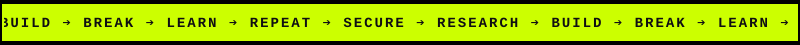
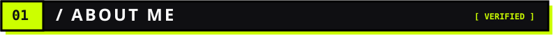
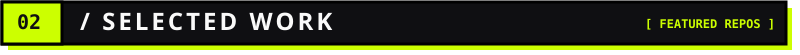
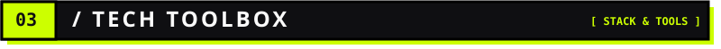
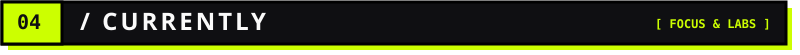
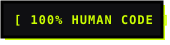
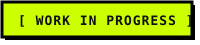
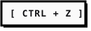

<div align="center">

  

  <br><br>

  

</div>

<br>



> **Computer Science Engineering (Cyber Security)** student at **Sri Sairam Institute of Technology, Chennai** (2024–2028).

* 🔬 **Research Focus**: Software supply-chain security, signed artifacts, SBOMs (Syft), build provenance (SLSA framework), and reproducible builds.
* 🎯 **Career Target**: Cybersecurity & Cloud Security Internships • Graduate Study (Master's in Cybersecurity Abroad).
* 💡 **Security Mindset**: Moving from fundamental hands-on labs (TryHackMe, picoCTF) to empirical security research with testable threat models and reproducible results.

<br>



```gdb
[ 01 / CHAINPROOF ] ➔ RESEARCH DIRECTION (Started August 2026)
```

> **Evidence-Based Verification of Software Supply-Chain Integrity**  
> Asks which combinations of code signatures, SLSA build provenance, Software Bills of Materials (SBOMs via Syft), and reproducible builds actually detect supply-chain tampering versus which ones only create false security assurance.  
> `Research Stack:` `Code Signatures` • `Syft (SBOM)` • `SLSA Framework` • `Reproducible Builds` • `Tampering Benchmark`  
> *Status: In active research & benchmark development. No code or results published yet.*

<br>

```gdb
[ 02 / NETRA ] ➔ COLLEGE PROJECT PROTOTYPE
```

> **Portable Network Security Device for Public Wi-Fi Protection**  
> Plug-and-play hardware appliance built on Raspberry Pi 2W + Linux. Intercepts untrusted Wi-Fi traffic, detects Man-in-the-Middle (MitM) attacks and port scans using Suricata IDS/IPS, blocks hostile traffic via `iptables`, and displays alerts on a web dashboard.  
> `Security Stack:` `Suricata IDS/IPS` • `iptables` • `Linux` • `Raspberry Pi 2W` • `Web Security Dashboard`  
> ↗ **[View GitHub Repository](https://github.com/maajed/defrox-ruf)**

<br>

```gdb
[ 03 / PROOF OF WORK ] ➔ 24-HOUR HACKATHON PROTOTYPE
```

> **Decentralized Labor Verification & AI Trust Infrastructure**  
> Built by Team "Peanut Butter" during Build2Gether AI Hackathon (2026). Features a worker passport system, peer verification workflows, custom backend logic, and an ML anomaly detection engine to flag suspicious activity spikes.  
> `Built Stack:` `HTML / CSS / JavaScript` • `Custom Backend` • `ML Anomaly Detection`  
> `Designed Concepts (Not Deployed):` `Decentralized Identity` • `Blockchain Ledger Schema` • `IPFS Storage (Planned)`  
> ↗ **[View GitHub Repository](https://github.com/bharanx/Proof-Of-Work)**

<br>



| Category | Verified Tech Stack |
| :--- | :--- |
| **Automation & Scripting** | `[ PYTHON ]` `[ HTML / CSS / JS ]` |
| **Traffic & Network Analysis** | `[ WIRESHARK ]` `[ CISCO PACKET TRACER ]` `[ TCP/IP ]` `[ NETWORK ANALYSIS ]` |
| **Containerization & OS** | `[ DOCKER ]` `[ LINUX ]` `[ RASPBERRY PI 2W ]` |
| **System & Security Inspection** | `[ NMAP ]` `[ BURP SUITE ]` `[ CAIDO ]` `[ SURICATA IDS/IPS ]` `[ IPTABLES ]` `[ PENETRATION TESTING FUNDAMENTALS ]` |

<br>



* 🛠️ **BUILDING**: ChainProof software supply-chain tampering verifier & benchmark.
* 🧪 **LAB PRACTICE**: **26 Rooms** completed on TryHackMe • **16 Challenges** completed on CyLab/picoCTF ([`bharanx`](https://learn.cylabacademy.org/users/bharanx)).
* 📚 **LEARNING**: PortSwigger Web Security Academy (SQL Injection, XSS, CSRF, Access Control).
* 🎯 **EXPLORING**: Build provenance verification against the SLSA framework.

<br>


<div align="center">

  
  &nbsp;
  

</div>

<br>


<div align="center">

```gdb
┌────────────────────────────────────────────────────────────────────────┐
│  🌐 PORTFOLIO  ➔  https://portfolio-lake-seven-97.vercel.app            │
├────────────────────────────────────────────────────────────────────────┤
│  💻 GITHUB     ➔  https://github.com/bharanx                         │
├────────────────────────────────────────────────────────────────────────┤
│  💼 LINKEDIN   ➔  https://linkedin.com/in/bharanidharan-s-4458b5326    │
├────────────────────────────────────────────────────────────────────────┤
│  📬 EMAIL      ➔  bharanibd2007@gmail.com                              │
└────────────────────────────────────────────────────────────────────────┘
```

</div>

<br><br>

<div align="center">

  
  &nbsp;&nbsp;
  
  &nbsp;&nbsp;
  
  &nbsp;&nbsp;
  

</div>

<br>


